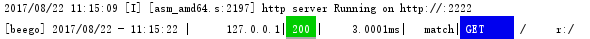
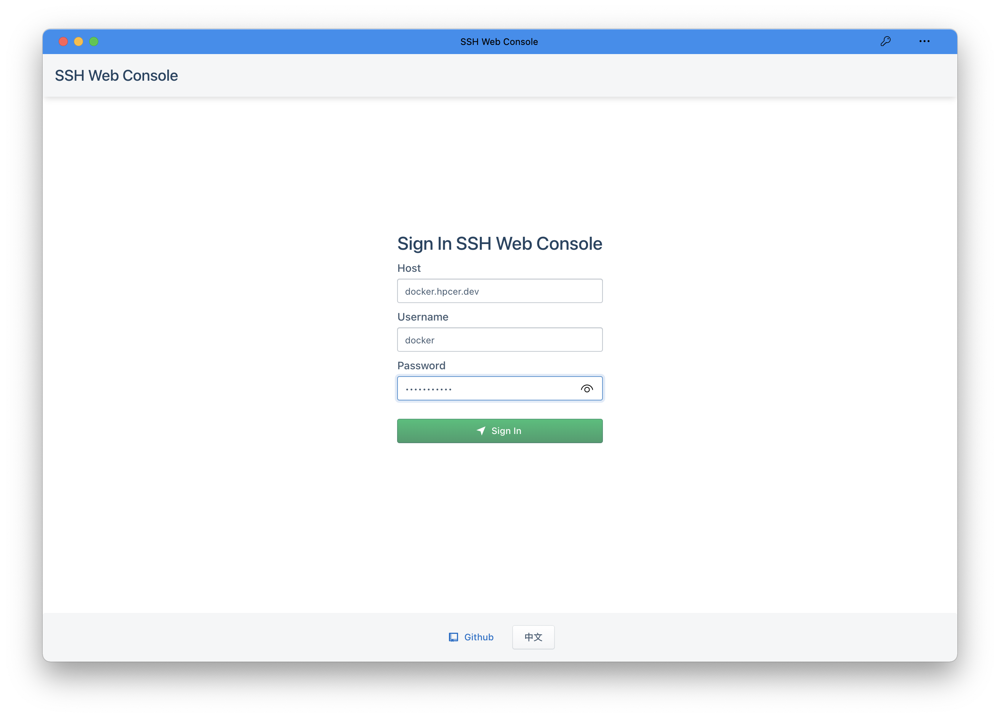
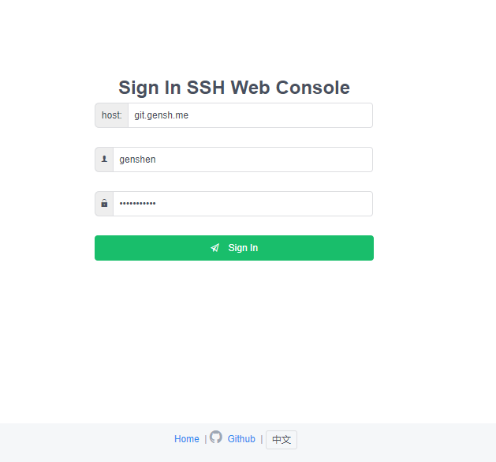
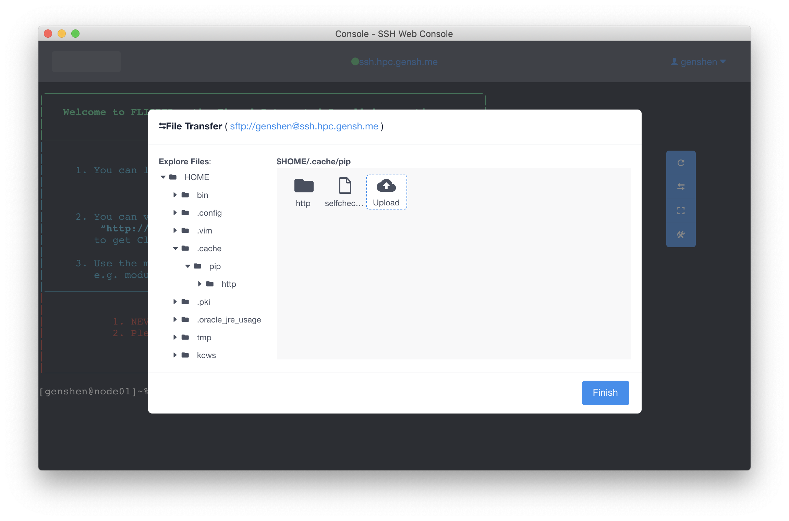

# sshWebConsole
you can connect to your linux machine by ssh in your browser.

## Dependency
```
go get -u github.com/astaxie/beego
go get -u github.com/gorilla/websocket
go get -u golang.org/x/crypto/ssh

```

## How to build
1. clone the repository [webConsole](https://github.com/genshen/webConsole) to any directory (example:/home/foo/webConsole) you like,and follow its README to build the frontend code.
2. copy the built files to present project:
   ```
   cp /home/foo/webConsole/dist/*  ./dist/
   cp /home/foo/webConsole/index_prod.html  ./views/index.html
   ```
3. set Dependency and run:***go build main.go*** to build present project (you can also use [bee tool](https://beego.me/docs/install/bee.md) to build).
4. run: ./main ,and than you can enjoy it in your browser.

## Screenshots
:
:
:
: